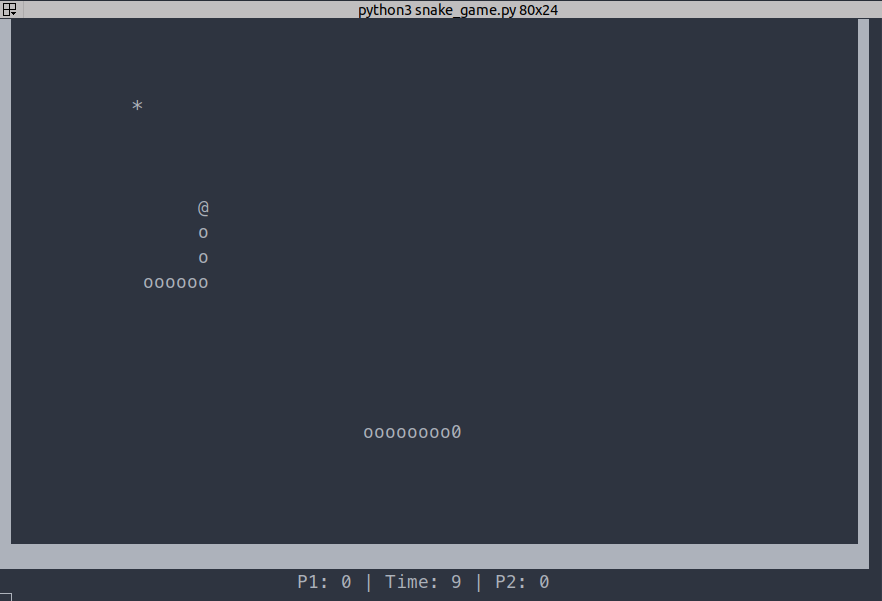

```
:'######::'##::: ##::::'###::::'##:::'##:'########:::::::'##::::'#######::'########::'#######::
'##... ##: ###:: ##:::'## ##::: ##::'##:: ##.....::::::'####:::'##.... ##: ##..  ##:'##.... ##:
 ##:::..:: ####: ##::'##:. ##:: ##:'##::: ##:::::::::::.. ##::: ##:::: ##:..:: ##::: ##::::..::
. ######:: ## ## ##:'##:::. ##: #####:::: ######::::::::: ##:::: ########:::: ##:::: ########::
:..... ##: ##. ####: #########: ##. ##::: ##...:::::::::: ##::::...... ##::: ##::::: ##.... ##:
'##::: ##: ##:. ###: ##.... ##: ##:. ##:: ##::::::::::::: ##:::'##:::: ##::: ##::::: ##:::: ##:
. ######:: ##::. ##: ##:::: ##: ##::. ##: ########:::::'######:. #######:::: ##:::::. #######::
:......:::..::::..::..:::::..::..::::..::........::::::......:::.......:::::..:::::::.......:::
```

[](https://travis-ci.org/github/GonnaFlyMethod/snake1976)
[](https://github.com/GonnaFlyMethod/snake1976/blob/master/setup.cfg)
[](https://github.com/GonnaFlyMethod/snake1976)
[](https://github.com/GonnaFlyMethod/snake1976/blob/master/LICENSE)
[](https://gitter.im/snake1976/community?utm_source=badge&utm_medium=badge&utm_campaign=pr-badge&utm_content=badge)

---

Snake 1976 is a terminal game that follows the logic of the classic snake.The game also contains some new game modes and features. Enjoy the game! :snake:

## Gameplay screenshots




## Getting Started

These instructions will get you a copy of the project up and running on your local machine for development and testing purposes.

## Requirements

```
Python (3.8), pip, poetry
```

## Installing

### Clone the project to your local machine

```
git clone https://github.com/GonnaFlyMethod/snake1976
```

### Install poetry  

```
pip install poetry
```

### Install all dependencies

You need to get to the directory with project 'snake1976' and then write in the terminal:

```
poetry install
```
### Install flake8 pre-commit hook

```
flake8 --install-hook git
git config --bool flake8.strict true
```
Now flake8 will respond to each of your commits. It's necessary to make your code cleaner.
If you see errors then make sure that you write these commands while you are in 'snake1976' folder.

## Running the game

You should be in the 'snake_project' folder, then the game can be started:

```
python snake_game.py
```

## Before commit

### Delete your game results

Before commit you need to make sure that there are 3 files in the 'records' folder and they are all empty:

```
snake_project/extra/game_environment/score_files/records/date_n_time.txt
snake_project/extra/game_environment/score_files/records/players.txt
snake_project/extra/game_environment/score_files/records/scores.txt
```

These files were generated in order to store player's name, his score, date and time when he played.
Of course, if you wanna save your results before removal then you can copy them to another place on you PC.

### Running the tests

When you get to the directory 'snake1976' just run the command:

```
pytest -s
```

## Authors

* **Alexander Gusakov** - *Initial work* - [GonnaFlyMethod](https://github.com/GonnaFlyMethod)

See also the list of [contributors](https://github.com/GonnaFlyMethod/snake1976-win/graphs/contributors/) who participated in this project.

## License

This project is licensed under the MIT License - see the [LICENSE.md](https://github.com/GonnaFlyMethod/snake1976-win/blob/master/LICENSE) file for details
